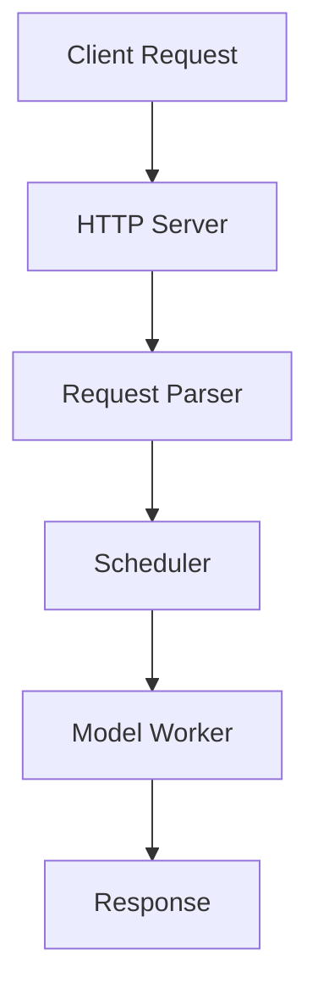

# DeepWiki-Style Architecture Documentation Generator

Generate comprehensive, structured architecture documentation with deep codebase analysis for any project type: $ARGUMENTS

**Best for**: Complex codebases requiring detailed analysis - frameworks, libraries, services, platforms, tooling, and systems of any kind.

## Current Architecture Context

### Project Overview
- Project root: !`pwd`
- Project name detection: !`basename $(pwd)` or from package manifest
- Project structure: !`find . -type f -name "*.json" -o -name "*.yaml" -o -name "*.toml" | head -5`
- README overview: @README.md (if exists)
- Existing documentation: @docs/ or @documentation/ or @README.md (if exists)
  - **Note**: Reference existing docs for context but ALWAYS verify against actual code
  - Existing documentation may be outdated - the code is the source of truth
- Architecture files: !`find . -name "*architecture*" -o -name "*design*" -o -name "*.puml" | head -3`

### Core Components Discovery
- Entry points and main files: !`find . -type f \( -name "main.*" -o -name "__main__.py" -o -name "index.*" -o -name "app.*" \) | grep -v "node_modules\|\.git\|test" | head -8`
- Core modules: !`find . -type f \( -name "*manager*" -o -name "*controller*" -o -name "*handler*" -o -name "*service*" \) | grep -v "node_modules\|\.git\|test" | head -10`
- Configuration system: !`find . -type f \( -name "*config*" -o -name "*settings*" -o -name "*options*" \) | grep -v "node_modules\|\.git\|test" | head -8`

### Interface and Integration
- API definitions: !`find . -name "*api*" -o -name "*openapi*" -o -name "*swagger*" -o -name "*proto*" | grep -v "node_modules\|\.git" | head -5`
- Server/HTTP components: !`find . -type f \( -name "*server*" -o -name "*http*" -o -name "*route*" \) | grep -v "node_modules\|\.git\|test" | head -8`
- CLI interfaces: !`find . -type f \( -name "*cli*" -o -name "*command*" -o -name "*cmd*" \) | grep -v "node_modules\|\.git\|test" | head -5`

### Deployment and Infrastructure
- Containers: @docker-compose.yml or @Dockerfile or @.dockerignore (if exists)
- Orchestration: @k8s/ or @kubernetes/ or @helm/ (if exists)
- CI/CD: @.github/workflows/ or @.gitlab-ci.yml or @.circleci/ (if exists)

### Project Evolution and Planning (Optional)
- Changelog: @CHANGELOG.md or @HISTORY.md or @RELEASES.md (if exists)
- Roadmap: @ROADMAP.md or @TODO.md or @PLANNING.md (if exists)
- Issues and milestones: @.github/ISSUE_TEMPLATE/ or @docs/roadmap/ (if exists)
- Version history: !`git tag -l | tail -10` (if git repo)
- Recent changes: !`git log --oneline --graph --decorate -20` (if git repo)

## Task

Generate comprehensive deepwiki-style architecture documentation with codebase-first analysis and multi-file structured output:

### 1. **Codebase Scanning and Feature Discovery**

**First, comprehensively scan the codebase to build a complete understanding:**

- **Project Type and Domain Identification**
  - Determine project category: web service, framework/library, CLI tool, data processing system, infrastructure component, platform, or hybrid
  - Identify the primary programming languages, frameworks, and runtime environments
  - Detect key dependencies and third-party libraries
  - Read package manifests and dependency files for metadata
  - Understand the project's purpose and target users

- **Core Architectural Patterns**
  - **Concurrency models**: Multi-process, multi-threading, async/await, event-driven, actor model
  - **Communication patterns**: IPC mechanisms (ZMQ, gRPC, pipes), message queues, pub-sub, RPC
  - **Distributed systems**: Clustering, sharding, replication, consensus, coordination
  - **Design patterns**: MVC, microservices, layered architecture, plugin systems, pipelines
  - **State management**: Stateless vs stateful, session management, caching strategies

- **Key Features and Capabilities Discovery**
  - **Data management**: Databases, caching, persistence, storage backends, data models
  - **Processing patterns**: Batch processing, stream processing, real-time, scheduled tasks
  - **Optimization techniques**: Caching, connection pooling, lazy loading, prefetching, compression
  - **Scalability features**: Load balancing, horizontal/vertical scaling, resource management
  - **Reliability**: Error handling, retry logic, circuit breakers, fallbacks, health checks

- **Component Discovery and Taxonomy**
  - **Entry points**: Main application, HTTP/API servers, CLI interfaces, workers, daemons
  - **Core modules**: Business logic, domain models, services, managers, controllers
  - **Data layer**: Repositories, DAOs, ORM models, query builders, migrations
  - **Integration layer**: External API clients, adapters, connectors, drivers
  - **Infrastructure**: Configuration, logging, monitoring, authentication, authorization
  - **Utilities**: Helpers, validators, formatters, parsers, converters

- **Integration and Interface Analysis**
  - External systems and dependencies
  - API contracts and protocols (REST, GraphQL, gRPC, WebSocket)
  - Authentication and authorization mechanisms
  - Data formats and serialization (JSON, Protocol Buffers, MessagePack)
  - Event schemas and messaging patterns

- **Data Flow and Processing Pipelines**
  - Request/response lifecycle
  - Data transformation stages
  - Validation and sanitization
  - Business logic execution flow
  - Inter-component communication patterns

- **Quality Attributes Assessment**
  - Performance optimization techniques
  - Security measures and controls
  - Monitoring and observability setup
  - Testing infrastructure and coverage
  - Error handling and logging strategies

- **Existing Documentation Review**
  - Read existing documentation (README.md, docs/, wikis) for context and high-level understanding
  - Extract useful descriptions, design rationale, and historical context
  - **CRITICAL**: Always verify documentation claims against actual code implementation
  - Note discrepancies between docs and code (code is always the source of truth)
  - Use existing docs to understand intent, but document actual implementation
  - Leverage good explanations from docs, but update with current reality

- **Project Evolution and Roadmap Discovery** (Optional - only if available)
  - **Historical Context**: 
    - Review CHANGELOG.md, HISTORY.md, or RELEASES.md for past development
    - Examine version tags and release notes for feature evolution
    - Analyze git history for major milestones and pivots
    - Identify deprecated features and migration paths
  - **Current State**:
    - Identify recent major changes and refactorings
    - Note experimental or beta features
    - Find TODO/FIXME comments in code indicating known issues
  - **Future Direction**:
    - Check ROADMAP.md, TODO.md, or similar planning documents
    - Review GitHub/GitLab issues labeled as "enhancement" or "future"
    - Look for milestone plans or project boards
    - Find code comments like "TODO: future optimization" or "planned feature"
  - **Technical Debt**:
    - Identify areas marked for refactoring
    - Find workarounds or temporary solutions
    - Note performance bottlenecks mentioned in code

**Output of this task**: Create a comprehensive feature map and component taxonomy that will guide the structure of all subsequent documentation sections. Store findings in working memory for reference.

### 2. **Documentation Framework and Structure Selection**

**Based on Task 1 findings, dynamically determine the optimal documentation structure:**

- **Select Documentation Style**
  - For complex ML/inference systems: Use deepwiki format with comprehensive tables and diagrams
  - For simpler projects: Use streamlined format with essential sections only
  - Adapt depth and detail based on codebase complexity

- **Choose Diagramming Approach**
  - Mermaid diagrams for architecture flows, component relationships, sequence diagrams
  - ASCII art for simple hierarchies
  - Tables for feature matrices and component mappings

- **Plan Documentation Structure Dynamically**
  - Based on Task 1 discoveries, determine which sections are needed
  - Each project will have a DIFFERENT structure based on its actual features
  - Create section hierarchy that matches the codebase organization
  - Plan the file structure for `docs/architecture/` with appropriate section files

- **Example Structures from Different Project Types**

**Example 1: ML Inference Framework** (vllm - serving engine):
```
- Overview
- Installation and Setup
- Core Architecture
- Configuration System
- LLM Client APIs
- Request Processing and Scheduling
- KV Cache Management
- Model Support
  - Model Registry and Loading
  - Text Generation Models
  - MultiModal Models
- Serving and API
- Performance Optimizations
  - Attention Mechanisms
  - Custom CUDA Operations
  - Quantization
- Hardware and Platform Support
- Testing Infrastructure
- Build System and Deployment
```

**Example 2: Communication Library** (deepep - HPC communication):
```
- Overview
- Getting Started
  - Installation
  - Build System
- Architecture
  - System Overview
  - Communication Model
  - Buffer System
- Communication Kernels
  - Intranode Kernels
  - Internode Kernels
  - Low-Latency Kernels
- C++ Runtime
- Hardware Integration
- Testing and Validation
- Performance Analysis
```

**Example 3: Web Service/API** (hypothetical REST API):
```
- Overview
- Getting Started
- System Architecture
  - High-Level Design
  - Component Overview
  - Data Flow
- API Design
  - REST Endpoints
  - Authentication
  - Rate Limiting
- Data Layer
  - Database Schema
  - ORM Models
  - Migrations
- Business Logic
  - Service Layer
  - Domain Models
- Infrastructure
  - Deployment Architecture
  - Caching Strategy
  - Message Queue
- Security
  - Authentication & Authorization
  - Data Protection
- Monitoring and Observability
- Testing Strategy
```

**Example 4: CLI Tool/Framework** (hypothetical build tool):
```
- Overview
- Installation
- Architecture Overview
- Command System
  - Command Registry
  - Argument Parsing
  - Plugin System
- Core Functionality
  - Build Pipeline
  - Dependency Resolution
  - Task Execution
- Configuration
- Extension System
- Testing Framework
- Performance and Caching
```

- **Establish Documentation Conventions**
  - Source file reference format: `` `path/to/file.py` `` with line numbers (`:123-456`)
  - Table format: Feature | Implementation | Key Classes | File Location
  - Cross-reference style: `[Section Name](filename.md)`
  - Code snippet attribution with file paths and function/class names

**Output of this task**: A clear, PROJECT-SPECIFIC documentation plan with custom sections based on actual codebase features, not a hardcoded template.

### 3. **Generate Documentation Sections Based on Discovered Features**

**Dynamically create documentation sections based on Task 1 and Task 2 findings.**

Instead of following a hardcoded structure, create sections that match what you discovered in the codebase. Below are examples of common section types - use only what's relevant:

#### Common Section Types (Use as Needed)

**Overview Section** (Always include):
- Write a "What is [Project]?" section explaining the system's purpose
- Describe primary use cases and target users
- List supported models, frameworks, or platforms (in table format)
- Include key metrics or capabilities
- Add high-level architecture diagram

**Installation and Setup** (If installation is non-trivial):
- Document installation methods (pip, docker, source)
- List dependencies and requirements
- Show environment setup steps
- Reference installation scripts

**Core Architecture / System Architecture**:
- High-level architecture diagram with main system layers
- Core components table: Component | File Location | Key Methods | Responsibility
- Multi-process/thread architecture (if applicable)
- Inter-process communication (ZMQ, gRPC, pipes)
- Message formats and data classes

**Configuration System** (If complex configuration exists):
- Document configuration parameters and structure
- Explain parameter validation and defaults
- Show configuration file formats
- Reference config classes and args

**Request Processing / Pipeline**:
- End-to-end sequence diagram
- Data transformation pipeline: Stage | Input → Output | File | Method
- Batching strategies (static, dynamic, continuous)
- Scheduling policies (FCFS, priority, custom)
- Key data classes and state transitions

**Memory Management / Caching**:
- Memory hierarchy (GPU/CPU/Storage tiers)
- Cache implementations: Type | Implementation | Storage | Eviction Policy
- Memory pools and allocation strategies
- Cache warming and prefetching

**Distributed Execution / Parallelism**:
- Parallelism strategies: Type | Parameter | Implementation | Communication
- Communication patterns (NCCL, MPI, collectives)
- Distributed coordination and synchronization
- Load balancing across workers

**Model Support / Model Execution**:
- Model loading and configuration
- Model registry and auto-detection
- Supported model architectures (text, multimodal, MoE, etc.)
- Weight loading and device placement

**Attention Mechanisms / Inference Engine**:
- Supported attention backends (FlashAttention, custom)
- Backend comparison table
- Attention optimizations

**Quantization** (If supported):
- Quantization schemes (FP8, INT4, AWQ, GPTQ)
- Configuration and weight loading
- Performance/accuracy tradeoffs

**Sampling and Generation** (For generative models):
- Sampling strategies and parameters
- Token generation process
- Output formatting and streaming

**Programming Interfaces**:
- Python API with example usage
- HTTP/REST API endpoints and formats
- Command-line interface
- OpenAI API compatibility (if applicable)

**Custom Kernels / Performance Optimizations**:
- Custom CUDA/ROCm/NPU kernels
- CUDA graph optimization
- Kernel fusion techniques
- Platform-specific optimizations

**Hardware and Platform Support**:
- Platform abstraction layer
- CUDA/ROCm/TPU/NPU/CPU platform implementations
- Hardware detection and selection
- Build system for different platforms

**Communication Kernels** (For communication libraries):
- Kernel implementations by type
- Intranode vs internode communication
- Low-latency optimizations
- Device utilities

**Runtime System** (For low-level systems):
- Runtime management
- Buffer implementation
- Memory management
- Lifecycle management

**Testing Infrastructure**:
- Test framework and organization
- Test types (unit, integration, performance)
- Test execution commands
- Coverage and CI/CD

**Benchmarking and Profiling**:
- Available benchmarks
- Performance metrics
- Profiling tools
- Baseline results

**Deployment and Operations**:
- Container deployment (Docker, Kubernetes)
- Server configuration
- Monitoring and observability
- Health checks and metrics

**Build System**:
- Build configuration
- Dependency management
- Platform-specific builds
- Installation packaging

**Project Evolution and Roadmap** (Optional - only if discoverable):
- Historical development: Past versions, major milestones, feature evolution
- Current state: Recent changes, experimental features, known issues
- Future direction: Planned features, roadmap items, upcoming improvements
- Technical debt: Areas marked for refactoring, workarounds, bottlenecks
- Version timeline: Major releases and their key features
- Deprecated features: What was removed and why
- Migration guides: How the project evolved over time

**How to discover**:
- Read CHANGELOG.md, HISTORY.md, RELEASES.md
- Review ROADMAP.md, TODO.md, planning documents
- Check GitHub/GitLab issues and milestones
- Analyze git tags and release notes
- Search code for TODO/FIXME comments
- Look for deprecation notices and migration docs

**Security and Compliance** (Important for production systems):
- Security architecture and threat model
- Authentication and authorization mechanisms
- Data protection and encryption
- Security boundaries and trust zones
- Compliance requirements and controls
- Vulnerability management
- Security monitoring and incident response

**Quality Attributes and Cross-Cutting Concerns**:
- Performance characteristics and optimization strategies
- Scalability patterns (horizontal/vertical scaling)
- Reliability and availability measures
- Maintainability and code organization
- Observability: logging, metrics, tracing
- Error handling and recovery strategies
- Resource management and efficiency

**Architecture Decision Records (ADRs)** (If using --with-adr flag):
- Create ADR template and structure
- Document key architectural decisions
- Record decision context and rationale
- Document alternatives considered
- Track consequences and trade-offs
- Set up ADR maintenance process

**Data Architecture** (For data-intensive applications):
- Data models and schemas
- Database design and relationships
- Data flow diagrams
- Data storage strategies
- Data governance and lifecycle
- Data integration and ETL pipelines
- Data consistency and integrity

**External Integrations**:
- Third-party services and APIs
- Integration patterns and adapters
- Webhook handlers
- Message queue integrations
- External authentication providers

**Domain-Specific Sections** (Include only if applicable):

*For ML/AI Systems:*
- Model execution and inference
- Training pipelines
- Model versioning and registry
- Feature engineering
- Quantization and optimization
- Hardware acceleration (GPU/TPU/NPU)
- Batch processing and serving

*For Web Applications:*
- Frontend architecture
- Backend services
- Database design
- Session management
- Asset pipeline
- CDN and static file serving

*For Data Processing:*
- ETL pipelines
- Data validation and quality
- Stream processing
- Batch processing
- Data warehousing
- Analytics and reporting

*For Infrastructure/Platform:*
- Resource provisioning
- Orchestration and scheduling
- Service mesh
- Network architecture
- Storage systems
- Disaster recovery

#### Guidelines for Section Creation

1. **Don't force fit**: Only create sections for features that actually exist
2. **Group logically**: Combine related topics into parent/child sections like examples show
3. **Match project style**: Communication library vs web service vs CLI tool vs framework
4. **Use consistent naming**: Look at similar projects for section naming conventions
5. **Create hierarchy**: Use parent sections with subsections (like "Model Support" → "Text Generation Models", "MultiModal Models")
6. **Consider audience**: Balance technical depth with readability for different stakeholders
7. **Include context**: Always explain "why" decisions were made, not just "what" exists

### 4. **Generate Index Structure First**

**IMPORTANT: Generate the index.md file FIRST before any detailed documentation.**

- **Determine Project Name**
  - Extract from directory name: `basename $(pwd)`
  - Or from package manifest (package.json, pyproject.toml, Cargo.toml)
  - This will be used for the output directory: `docs/<project-name>/`

- **Create `docs/<project-name>/index.md` First**
  - Add document title: "# [Project Name] Architecture Documentation"
  - Include "Last indexed: [date] ([commit hash])" at the top (like deepwiki format)
  - Create comprehensive table of contents with all sections determined in Task 2
  - Format as a clean hierarchical list (see deepwiki examples)
  - Main sections are top-level items
  - Subsections are indented under their parent sections
  - Each section links to its corresponding markdown file

**Index Structure Example**:
```markdown
# SGLang Architecture Documentation

Last indexed: 19 October 2025 (1d7265)

---

## Overview

## System Architecture
- Multi-Process Architecture and IPC
- Request Scheduling and Batching
- Memory Management and HiCache

## Model Execution
- Model Configuration and Loading
- Attention Mechanisms and Backends

## Programming Interfaces
- Python Engine API
- HTTP Server and OpenAI API

...
```

### 5. **Generate Detailed Documentation Files**

**After index.md is created, generate each section as a separate file:**

- **File Organization Strategy**
  - Each **first-level section** from the index becomes a separate markdown file
  - Subsections are included within their parent section file
  - Place all files in `docs/<project-name>/` directory
  - Name files descriptively using kebab-case (e.g., `system-architecture.md`, `model-execution.md`)

**File Naming Pattern**:
- Index section "System Architecture" → `system-architecture.md`
- Index section "Model Execution" → `model-execution.md`
- Index section "Programming Interfaces" → `programming-interfaces.md`
- Keep names concise but clear

- **Generate Each Documentation File**
  - Create content for each section planned in Task 2 and listed in index.md
  - Follow the content guidelines from Task 3 for each section type
  - Include deepwiki-style formatting: tables, diagrams, source references with line numbers
  - Add navigation: Link back to index at top: `[← Back to Index](index.md)`
  - Cross-reference related sections with proper file links

- **Ensure Documentation Quality**
  - All source file references must be accurate with correct paths
  - Include line numbers for specific code references (`:123-456`)
  - All Mermaid diagrams should be syntactically correct
  - Tables must be properly formatted with aligned columns
  - Cross-references must use correct file names/anchors
  - Verify all links work (especially links to other documentation files)

- **Add Metadata to Each File**
  - Include generation timestamp
  - Reference source code commit hash
  - Note any assumptions or limitations in the analysis

## Documentation Format Guidelines

### Source File References
- Use inline code format with path: `` `path/to/file.py` ``
- Include line numbers when referencing specific code: `` `path/to/file.py:123-456` ``
- For multiple references: `` `file1.py`, `file2.py`, `file3.py` ``

### Feature Tables
Always use this format for feature/component tables:
```
| Feature/Component | Implementation | Key Classes/Functions | File Location |
|-------------------|----------------|----------------------|---------------|
| Name | Description | `ClassName`, `function_name` | `path/to/file.py:123-456` |
```

### Mermaid Diagrams
Use Mermaid for all architectural diagrams:
- `graph TB` or `graph LR` for component relationships
- `sequenceDiagram` for request flows
- `flowchart` for decision trees and pipelines
- Keep diagrams focused and not too complex (max 10-15 nodes)

Example:


### Code Snippets
When showing code snippets:
- Always attribute with file path and function/class name
- Use appropriate language syntax highlighting
- Keep snippets focused and relevant (not entire files)
- Add explanatory comments for complex logic

Example:
```python
# From: path/to/scheduler.py:123-135
class Scheduler:
    def get_next_batch(self):
        # Select requests for next batch
        return self.policy.select(self.queue)
```

### Cross-References
- Link to other documentation sections: `[Section Name](filename.md)`
- Link to specific subsections: `[Subsection](filename.md#anchor)`
- Use descriptive link text, not "click here"

### Metadata and Attribution
Each generated documentation file should start with:
```markdown
# Section Title

**Part of**: [Architecture Documentation](index.md)
**Generated**: [timestamp]
**Source commit**: [hash]

---
```

### Optional: Project Evolution and Roadmap Section

**Only include this section if you can discover meaningful information from the codebase.**

This section helps understand:
- Where the project came from (historical context)
- Where it is now (current state and recent changes)
- Where it's going (future plans and roadmap)
- What challenges exist (technical debt)

**Example Format**:

```markdown
# Project Evolution and Roadmap

[← Back to Index](index.md)

**Generated**: 2025-11-02
**Source commit**: abc123

---

## Historical Development

### Version Timeline

| Version | Date | Key Features | Notes |
|---------|------|--------------|-------|
| v3.0.0 | Oct 2025 | RadixCache, HiCache | Major performance improvement |
| v2.5.0 | Aug 2025 | Multi-model support | Added vision models |
| v2.0.0 | Jun 2025 | Distributed inference | Breaking API changes |
| v1.0.0 | Jan 2025 | Initial release | Single-node only |

### Major Milestones

- **Q1 2025**: Project inception, single-node inference
- **Q2 2025**: Added distributed support with tensor parallelism
- **Q3 2025**: Introduced hierarchical caching (HiCache)
- **Q4 2025**: Production-ready with extensive testing

### Deprecated Features

- **Old KV cache API** (removed in v2.0): Replaced with RadixCache
- **Synchronous-only API** (removed in v2.5): Now async-first
- **Single-model batching** (deprecated): Multi-model batching preferred

## Current State

### Recent Major Changes (Last 3 Months)

- Introduced prefill-decode disaggregation for better resource utilization
- Added FP4 quantization support
- Refactored scheduler for improved throughput
- Migrated to new attention backend (FlashInfer)

### Experimental Features

- **Speculative decoding**: In beta, may change
- **Multi-LoRA serving**: Experimental support
- **NPU backend**: Under active development

### Known Issues

From code analysis (TODO/FIXME comments):
- Performance bottleneck in token detokenization (Issue #234)
- Memory leak in multi-tenant scenarios (being investigated)
- CUDA graph incompatibility with certain models (workaround in place)

## Future Direction

### Planned Features

From ROADMAP.md and GitHub milestones:

**Q4 2025** (In Progress):
- [ ] Improve quantization accuracy (FP4/INT4)
- [ ] Add support for more vision models
- [ ] Optimize multi-LoRA serving

**Q1 2026** (Planned):
- [ ] Disaggregated serving at scale
- [ ] Advanced scheduling policies
- [ ] Multi-cloud deployment support

**Q2 2026** (Proposed):
- [ ] Model compression techniques
- [ ] Edge device deployment
- [ ] Real-time streaming improvements

### Areas for Improvement

Identified from code comments and discussions:

1. **Scheduler refactoring**: Current design has scalability limits
2. **Memory management**: Need better memory pressure handling
3. **Observability**: Improve metrics and tracing
4. **Documentation**: API documentation needs updates

## Technical Debt

### High Priority

- Refactor legacy batching code (marked for removal in v4.0)
- Replace temporary workaround for NCCL initialization
- Optimize hot path in request processing

### Medium Priority

- Consolidate duplicate code in attention backends
- Improve error handling in distributed scenarios
- Update deprecated dependencies

### Low Priority

- Code cleanup in legacy modules
- Improve test coverage for edge cases
- Standardize logging format

## Migration Guides

### Upgrading from v2.x to v3.x

Major breaking changes:
- KV cache API completely rewritten
- Configuration format changed
- Async API now required

See [MIGRATION.md](../MIGRATION.md) for detailed guide.

---

**Sources**:
- CHANGELOG.md
- ROADMAP.md
- GitHub Issues and Milestones
- Code TODO/FIXME comments
- Git commit history
```

**Tips for creating this section**:
1. Read CHANGELOG/HISTORY for version history
2. Check ROADMAP/TODO files for future plans
3. Search codebase for TODO/FIXME/HACK comments
4. Look at recent git commits for trends
5. Review GitHub/GitLab issues for planned features
6. Note deprecated functions and migration guides

## Output Structure

The output structure should be **dynamically determined** based on the project. 

**Directory Structure**: `docs/<project-name>/`

Where `<project-name>` is extracted from:
- Directory name: `basename $(pwd)`
- Or package manifest (package.json `name`, pyproject.toml `[project] name`, etc.)

### Example Output Structures

**Example 1 - ML Inference Engine** (sglang):
```
docs/sglang/
├── index.md                          # Master TOC (GENERATE FIRST)
├── overview.md                       # What is SGLang?
├── installation.md                   # Installation and setup
├── system-architecture.md            # Multi-process architecture, IPC
├── request-processing.md             # Request scheduling and batching
├── memory-management.md              # HiCache and memory pools
├── distributed-execution.md          # Parallelism strategies
├── model-execution.md                # Model loading, attention, quantization
├── programming-interfaces.md         # Python API, HTTP server, CLI
├── kernel-library.md                 # Custom CUDA/ROCm kernels
├── deployment.md                     # Docker and server configuration
├── testing.md                        # Testing and benchmarking
└── roadmap.md                        # [OPTIONAL] Project evolution and future plans
```

**Example 2 - Communication Library** (deepep):
```
docs/deepep/
├── index.md                          # Master TOC (GENERATE FIRST)
├── overview.md                       # What is DeepEP?
├── getting-started.md                # Installation and build
├── architecture.md                   # System overview, communication model
├── communication-kernels.md          # Intranode and internode kernels
├── runtime-system.md                 # C++ runtime and buffer management
├── hardware-integration.md           # NVSHMEM, IBGDA
├── python-api.md                     # Python bindings
├── testing.md                        # Test framework
└── performance-analysis.md           # Performance tuning
```

**Example 3 - Web API Service** (myapi):
```
docs/myapi/
├── index.md                          # Master TOC (GENERATE FIRST)
├── overview.md                       # Service overview
├── getting-started.md                # Setup and installation
├── system-architecture.md            # High-level design and data flow
├── api-design.md                     # REST endpoints, authentication
├── data-layer.md                     # Database schema, ORM models
├── business-logic.md                 # Service layer, domain models
├── infrastructure.md                 # Deployment, caching, message queue
├── security.md                       # Authentication & authorization
├── monitoring.md                     # Observability and logging
├── testing.md                        # Testing strategy
└── evolution.md                      # [OPTIONAL] Version history and future plans
```

**Example 4 - CLI Tool** (mybuild):
```
docs/mybuild/
├── index.md                          # Master TOC (GENERATE FIRST)
├── overview.md                       # Tool purpose
├── installation.md                   # Installation
├── architecture.md                   # Core design
├── command-system.md                 # Command processing and registry
├── plugin-system.md                  # Extension system
├── configuration.md                  # Config management
└── testing.md                        # Testing framework
```

**Example 5 - Smaller Project** (optional single file):
```
docs/myproject/
└── index.md                          # All sections in one file
```

**Key Principles:**
- **Flexible**: Structure adapts to what's actually in the codebase
- **Descriptive names**: Use clear file names (not just numbers)
- **Hierarchical**: Group related topics (can use subdirectories for very large projects)
- **No forced structure**: Only create files for sections that are needed

## Documentation Workflow

**Follow this sequence for optimal results:**

1. **Task 1: Scan Codebase** → Understand the actual implementation, patterns, and features
2. **Review Existing Docs** → Read for context, but verify everything against code
3. **Task 2: Plan Structure** → Determine sections based on what you discovered
4. **Task 4: Generate Index First** → Create `docs/<project-name>/index.md` with TOC
5. **Task 5: Generate Detail Files** → Create each first-level section as a separate file

**Critical Rule**: Code is the source of truth. Existing documentation may be outdated.

## Best Practices

### Documentation Approach
1. **Code-First Analysis**: Always scan and understand the actual code implementation before writing documentation
2. **Verify Existing Docs**: Reference existing documentation for context, but ALWAYS verify against actual code
3. **Code is Truth**: When docs and code conflict, document what the code actually does, not what docs claim
4. **Adapt to Context**: Tailor structure and depth to the project type and complexity
5. **Explain Decisions**: Document not just "what" exists but "why" decisions were made
6. **Show Trade-offs**: Include alternatives considered and rationale for choices
7. **Identify Patterns**: Look for and document architectural patterns and design principles

### Content Quality
8. **Accuracy**: All file paths, line numbers, and code references must be accurate
9. **Completeness**: Cover all major components discovered in the codebase scan
10. **Clarity**: Use clear language accessible to different technical levels
11. **Visual Aids**: Include diagrams for complex relationships and flows
12. **Examples**: Provide code examples and usage patterns where helpful

### Organization
13. **Logical Grouping**: Group related concepts into cohesive sections
14. **Clear Hierarchy**: Use parent/child sections to show relationships
15. **Easy Navigation**: Provide clear table of contents and cross-references
16. **Consistent Naming**: Use consistent terminology throughout

### Maintenance
17. **Version Tracking**: Include generation timestamp and commit hash
18. **Living Documentation**: Design for easy updates as code evolves
19. **Validation**: Verify all links, diagrams, and references work
20. **Metadata**: Document assumptions and scope limitations

### Architectural Focus
21. **System Context**: Start with high-level view before diving into details
22. **Component Boundaries**: Clearly define responsibilities and interfaces
23. **Data Flow**: Show how data moves through the system
24. **Quality Attributes**: Document performance, security, scalability considerations
25. **Evolution**: Note areas of technical debt and future improvements

### Stakeholder Considerations
26. **Multiple Audiences**: Balance needs of developers, architects, and operators
27. **Onboarding Value**: Make it useful for new team members
28. **Decision Support**: Help readers understand implications of changes
29. **Reference Material**: Organize for both learning and quick lookup

