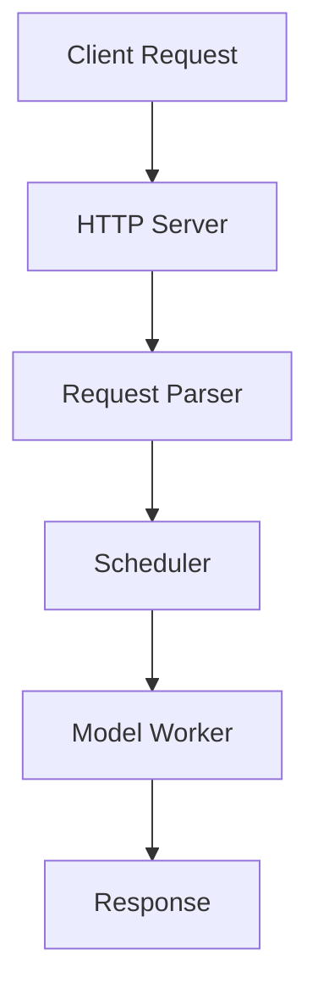

# DeepWiki-Style Architecture Documentation Generator

Generate comprehensive, structured architecture documentation with deep codebase analysis for any project type: $ARGUMENTS

**Best for**: Complex codebases requiring detailed analysis - frameworks, libraries, services, platforms, tooling, and systems of any kind.

**Default behavior**: Deep analysis with multi-file output to `docs/<project-name>/`

**Optional flags**:
- `--with-adr`: Generate Architecture Decision Records in `docs/adr/`
- `--with-diagrams`: Include PlantUML and additional diagram formats
- `--single-file`: Output all documentation in a single `index.md` file (instead of multiple files)

## Current Architecture Context

### Project Overview
- Project root: !`pwd`
- Project name detection: !`basename $(pwd)` or from package manifest
- Project structure: !`find . -type f -name "*.json" -o -name "*.yaml" -o -name "*.toml" | head -5`
- README overview: @README.md (if exists)
- Existing documentation: @docs/ or @documentation/ or @README.md (if exists)
  - **Note**: Reference existing docs for context but ALWAYS verify against actual code
  - Existing documentation may be outdated - the code is the source of truth
- Architecture files: !`find . -name "*architecture*" -o -name "*design*" -o -name "*.puml" | head -3`

### Core Components Discovery
- Entry points and main files: !`find . -type f \( -name "main.*" -o -name "__main__.py" -o -name "index.*" -o -name "app.*" -o -name "server.*" -o -name "run.*" \) | grep -v "node_modules\|\.git\|test\|dist\|build" | head -20`
- Core modules: !`find . -type f \( -name "*manager*" -o -name "*controller*" -o -name "*handler*" -o -name "*service*" -o -name "*core*" -o -name "*engine*" \) | grep -v "node_modules\|\.git\|test\|dist\|build" | head -30`
- Configuration system: !`find . -type f \( -name "*config*" -o -name "*settings*" -o -name "*options*" -o -name "*env*" \) | grep -v "node_modules\|\.git\|test\|dist\|build" | head -20`

### Interface and Integration
- API definitions: !`find . -name "*api*" -o -name "*openapi*" -o -name "*swagger*" -o -name "*proto*" -o -name "*schema*" | grep -v "node_modules\|\.git\|test\|dist\|build" | head -15`
- Server/HTTP components: !`find . -type f \( -name "*server*" -o -name "*http*" -o -name "*route*" -o -name "*endpoint*" -o -name "*middleware*" \) | grep -v "node_modules\|\.git\|test\|dist\|build" | head -25`
- CLI interfaces: !`find . -type f \( -name "*cli*" -o -name "*command*" -o -name "*cmd*" \) | grep -v "node_modules\|\.git\|test\|dist\|build" | head -15`

### Extended Code Analysis
- Database/data layer: !`find . -type f \( -name "*model*" -o -name "*schema*" -o -name "*repository*" -o -name "*dao*" -o -name "*migration*" -o -name "*seed*" \) | grep -v "node_modules\|\.git\|test\|dist\|build" | head -20`
- Testing infrastructure: !`find . -name "*test*" -o -name "*spec*" | grep -v "node_modules\|\.git" | head -15`
- Build/deployment: !`find . -name "*webpack*" -o -name "*vite*" -o -name "*rollup*" -o -name "*gulp*" -o -name "*grunt*" -o -name "Dockerfile*" -o -name "*.dockerfile" | head -10`
- Package configurations: !`find . -name "package.json" -o -name "requirements.txt" -o -name "Cargo.toml" -o -name "go.mod" -o -name "pom.xml" -o -name "build.gradle" | head -10`
- Language-specific configs: !`find . -name "tsconfig.json" -o -name ".eslintrc*" -o -name "pyproject.toml" -o -name "setup.py" -o -name "CMakeLists.txt" | head -10`

### Deployment and Infrastructure
- Containers: @docker-compose.yml or @Dockerfile or @.dockerignore (if exists)
- Orchestration: @k8s/ or @kubernetes/ or @helm/ (if exists)
- CI/CD: @.github/workflows/ or @.gitlab-ci.yml or @.circleci/ (if exists)

### Project Evolution and Planning (Optional)
- Changelog: @CHANGELOG.md or @HISTORY.md or @RELEASES.md (if exists)
- Roadmap: @ROADMAP.md or @TODO.md or @PLANNING.md (if exists)
- Issues and milestones: @.github/ISSUE_TEMPLATE/ or @docs/roadmap/ (if exists)
- Version history: !`git tag -l | tail -10` (if git repo)
- Recent changes: !`git log --oneline --graph --decorate -20` (if git repo)

## Task

Generate comprehensive deepwiki-style architecture documentation with codebase-first analysis and multi-file structured output:

### 1. **Codebase Scanning and Feature Discovery**

**First, comprehensively scan the codebase to build a complete understanding:**

- **Project Type and Domain Identification**
  - Determine project category: web service, framework/library, CLI tool, data processing system, infrastructure component, platform, or hybrid
  - Identify the primary programming languages, frameworks, and runtime environments
  - Detect key dependencies and third-party libraries
  - Read package manifests and dependency files for metadata
  - Understand the project's purpose and target users
  - **Deep language analysis**: Scan ALL source files by language:
    - Python: `find . -name "*.py" | grep -v "node_modules\|\.git\|test" | head -50`
    - JavaScript/TypeScript: `find . -name "*.js" -o -name "*.ts" -o -name "*.jsx" -o -name "*.tsx" | grep -v "node_modules\|\.git\|test" | head -50`
    - Go: `find . -name "*.go" | grep -v "vendor\|\.git\|test" | head -30`
    - Rust: `find . -name "*.rs" | grep -v "target\|\.git\|test" | head -30`
    - C/C++: `find . -name "*.c" -o -name "*.cpp" -o -name "*.h" -o -name "*.hpp" | grep -v "build\|\.git\|test" | head -30`
    - Java: `find . -name "*.java" | grep -v "build\|\.git\|test" | head -30`

- **Core Architectural Patterns**
  - **Concurrency models**: Multi-process, multi-threading, async/await, event-driven, actor model
  - **Communication patterns**: IPC mechanisms (ZMQ, gRPC, pipes), message queues, pub-sub, RPC
  - **Distributed systems**: Clustering, sharding, replication, consensus, coordination
  - **Design patterns**: MVC, microservices, layered architecture, plugin systems, pipelines
  - **State management**: Stateless vs stateful, session management, caching strategies
  - **Pattern detection through code analysis**:
    - Search for architectural keywords: `grep -r -i "singleton\|factory\|observer\|decorator\|strategy\|proxy\|adapter\|command\|facade" --include="*.py" --include="*.js" --include="*.ts" --include="*.go" --include="*.java" | head -20`
    - Search for concurrency patterns: `grep -r -i "async\|await\|thread\|process\|goroutine\|mutex\|lock\|semaphore\|channel" --include="*.py" --include="*.js" --include="*.ts" --include="*.go" | head -20`
    - Search for IPC/communication: `grep -r -i "grpc\|zmq\|redis\|rabbitmq\|kafka\|websocket\|http\|rest" --include="*.py" --include="*.js" --include="*.ts" | head -20`

- **Key Features and Capabilities Discovery**
  - **Data management**: Databases, caching, persistence, storage backends, data models
  - **Processing patterns**: Batch processing, stream processing, real-time, scheduled tasks
  - **Optimization techniques**: Caching, connection pooling, lazy loading, prefetching, compression
  - **Scalability features**: Load balancing, horizontal/vertical scaling, resource management
  - **Reliability**: Error handling, retry logic, circuit breakers, fallbacks, health checks
  - **Comprehensive feature scanning**:
    - Database integrations: `grep -r -i "database\|db\|sql\|nosql\|mysql\|postgres\|mongodb\|redis" --include="*.py" --include="*.js" --include="*.ts" --include="*.go" | head -20`
    - Caching mechanisms: `grep -r -i "cache\|lru\|ttl\|expire\|memory.*cache" --include="*.py" --include="*.js" --include="*.ts" | head -20`
    - Error handling patterns: `grep -r -i "try.*catch\|except\|error\|exception\|fail\|retry\|circuit.*breaker" --include="*.py" --include="*.js" --include="*.ts" | head -20`

- **Component Discovery and Taxonomy**
  - **Entry points**: Main application, HTTP/API servers, CLI interfaces, workers, daemons
  - **Core modules**: Business logic, domain models, services, managers, controllers
  - **Data layer**: Repositories, DAOs, ORM models, query builders, migrations
  - **Integration layer**: External API clients, adapters, connectors, drivers
  - **Infrastructure**: Configuration, logging, monitoring, authentication, authorization
  - **Utilities**: Helpers, validators, formatters, parsers, converters
  - **Deep component enumeration**:
    - All source files by type: `find . -name "*.py" -o -name "*.js" -o -name "*.ts" -o -name "*.go" -o -name "*.rs" -o -name "*.java" | grep -v "node_modules\|\.git\|vendor\|target\|_build" | wc -l && find . -name "*.py" -o -name "*.js" -o -name "*.ts" -o -name "*.go" -o -name "*.rs" -o -name "*.java" | grep -v "node_modules\|\.git\|vendor\|target\|_build" | head -50`
    - Class/struct analysis: `grep -r "^\s*class\|^\s*struct\|^\s*interface\|^\s*type.*struct" --include="*.py" --include="*.js" --include="*.ts" --include="*.go" --include="*.rs" | head -30`
    - Function/method discovery: `grep -r "def\|function\|func\s\|public\|private" --include="*.py" --include="*.js" --include="*.ts" --include="*.go" --include="*.java" | head -40`

- **Integration and Interface Analysis**
  - External systems and dependencies
  - API contracts and protocols (REST, GraphQL, gRPC, WebSocket)
  - Authentication and authorization mechanisms
  - Data formats and serialization (JSON, Protocol Buffers, MessagePack)
  - Event schemas and messaging patterns
  - **Interface exploration**:
    - API route definitions: `grep -r -i "endpoint\|route\|@.*route\|@.*api\|app\.\(get\|post\|put\|delete\)" --include="*.py" --include="*.js" --include="*.ts" | head -20`
    - External service integrations: `grep -r -i "import.*requests\|fetch\|axios\|http\|grpc\|amqp\|smqp" --include="*.py" --include="*.js" --include="*.ts" | head -15`
    - Authentication/security: `grep -r -i "auth\|jwt\|oauth\|token\|password\|hash" --include="*.py" --include="*.js" --include="*.ts" | head -15`

- **Data Flow and Processing Pipelines**
  - Request/response lifecycle
  - Data transformation stages
  - Validation and sanitization
  - Business logic execution flow
  - Inter-component communication patterns
  - **Pipeline analysis**:
    - Data flow patterns: `grep -r -i "pipeline\|stream\|flow\|transform\|process\|filter\|map\|reduce" --include="*.py" --include="*.js" --include="*.ts" | head -20`
    - Validation logic: `grep -r -i "validate\|sanitiz\|check\|verify\|ensure" --include="*.py" --include="*.js" --include="*.ts" | head -15`

- **Quality Attributes Assessment**
  - Performance optimization techniques
  - Security measures and controls
  - Monitoring and observability setup
  - Testing infrastructure and coverage
  - Error handling and logging strategies
  - **Quality analysis**:
    - Testing patterns: `find . -name "*test*" -o -name "*spec*" | grep -v "node_modules\|\.git" | head -20` and `grep -r -i "describe\|it\(|test\|assert\|expect" --include="*.py" --include="*.js" --include="*.ts" | head -15`
    - Monitoring/logging: `grep -r -i "log\|monitor\|metric\|track\|observ" --include="*.py" --include="*.js" --include="*.ts" | head -15`
    - Performance: `grep -r -i "performance\|benchmark\|profile\|optimize\|cache\|lazy" --include="*.py" --include="*.js" --include="*.ts" | head -15`

- **Existing Documentation Review**
  - Read existing documentation (README.md, docs/, wikis) for context and high-level understanding
  - Extract useful descriptions, design rationale, and historical context
  - **CRITICAL**: Always verify documentation claims against actual code implementation
  - Note discrepancies between docs and code (code is always the source of truth)
  - Use existing docs to understand intent, but document actual implementation
  - Leverage good explanations from docs, but update with current reality

- **Project Evolution and Roadmap Discovery** (Always include - generate from available sources)
  - **Historical Context**: 
    - Review CHANGELOG.md, HISTORY.md, or RELEASES.md for past development
    - Examine version tags and release notes for feature evolution
    - Analyze git history for major milestones and pivots
    - Identify deprecated features and migration paths
  - **Current State**:
    - Identify recent major changes and refactorings
    - Note experimental or beta features
    - Find TODO/FIXME comments in code indicating known issues:
      ```bash
      grep -r "TODO\|FIXME\|HACK\|NOTE\|XXX\|BUG" --include="*.py" --include="*.js" --include="*.ts" --include="*.go" | head -20
      ```
  - **Future Direction**:
    - Check ROADMAP.md, TODO.md, or similar planning documents
    - Review GitHub/GitLab issues labeled as "enhancement" or "future"
    - Look for milestone plans or project boards
    - Find code comments like "TODO: future optimization" or "planned feature"
    - **If no formal roadmap exists**: Note inferred direction from code patterns, recent commits, and architectural changes
  - **Technical Debt**:
    - Identify areas marked for refactoring
    - Find workarounds or temporary solutions
    - Note performance bottlenecks mentioned in code
    - **If minimal technical debt found**: State that the codebase appears well-maintained

**Output of this task**: Create a comprehensive feature map and component taxonomy that will guide the structure of all subsequent documentation sections. Store findings in working memory for reference.

### 2. **Documentation Framework and Structure Selection**

**Based on Task 1 findings, dynamically determine the optimal documentation structure:**

- **Select Documentation Style**
  - For complex ML/inference systems: Use deepwiki format with comprehensive tables and diagrams
  - For simpler projects: Use streamlined format with essential sections only
  - Adapt depth and detail based on codebase complexity

- **Choose Diagramming Approach**
  - Mermaid diagrams for architecture flows, component relationships, sequence diagrams
  - ASCII art for simple hierarchies
  - Tables for feature matrices and component mappings

- **Optional Documentation Frameworks** (Use if helpful)
  - **C4 Model**: 4-level hierarchy (Context → Containers → Components → Code) for system visualization
  - **Arc42**: Comprehensive template with 12 sections for thorough documentation
  - **PlantUML**: Alternative to Mermaid for complex diagrams (use with `--with-diagrams`)
  - **Note**: These are suggestions, not requirements. Adapt based on project needs.

- **Plan Documentation Structure Dynamically**
  - Based on Task 1 discoveries, determine which sections are needed
  - Each project will have a DIFFERENT structure based on its actual features
  - Create section hierarchy that matches the codebase organization
  - Plan the file structure for `docs/architecture/` with appropriate section files

- **Example Structures from Different Project Types**

**Example 1: ML Inference Framework** (vllm - serving engine):
```
- Overview
- Installation and Setup
- Core Architecture
- Configuration System
- LLM Client APIs
- Request Processing and Scheduling
- KV Cache Management
- Model Support
  - Model Registry and Loading
  - Text Generation Models
  - MultiModal Models
- Serving and API
- Performance Optimizations
  - Attention Mechanisms
  - Custom CUDA Operations
  - Quantization
- Hardware and Platform Support
- Testing Infrastructure
- Build System and Deployment
```

**Example 2: Communication Library** (deepep - HPC communication):
```
- Overview
- Getting Started
  - Installation
  - Build System
- Architecture
  - System Overview
  - Communication Model
  - Buffer System
- Communication Kernels
  - Intranode Kernels
  - Internode Kernels
  - Low-Latency Kernels
- C++ Runtime
- Hardware Integration
- Testing and Validation
- Performance Analysis
```

**Example 3: Web Service/API** (hypothetical REST API):
```
- Overview
- Getting Started
- System Architecture
  - High-Level Design
  - Component Overview
  - Data Flow
- API Design
  - REST Endpoints
  - Authentication
  - Rate Limiting
- Data Layer
  - Database Schema
  - ORM Models
  - Migrations
- Business Logic
  - Service Layer
  - Domain Models
- Infrastructure
  - Deployment Architecture
  - Caching Strategy
  - Message Queue
- Security
  - Authentication & Authorization
  - Data Protection
- Monitoring and Observability
- Testing Strategy
```

**Example 4: CLI Tool/Framework** (hypothetical build tool):
```
- Overview
- Installation
- Architecture Overview
- Command System
  - Command Registry
  - Argument Parsing
  - Plugin System
- Core Functionality
  - Build Pipeline
  - Dependency Resolution
  - Task Execution
- Configuration
- Extension System
- Testing Framework
- Performance and Caching
```

- **Establish Documentation Conventions**
  - Source file reference format: `` `path/to/file.py` `` with line numbers (`:123-456`)
  - Table format: Feature | Implementation | Key Classes | File Location
  - Cross-reference style: `[Section Name](filename.md)`
  - Code snippet attribution with file paths and function/class names

**Output of this task**: A clear, PROJECT-SPECIFIC documentation plan with custom sections based on actual codebase features, not a hardcoded template.

### 3. **Generate Documentation Sections Based on Discovered Features**

**Dynamically create documentation sections based on Task 1 and Task 2 findings.**

Instead of following a hardcoded structure, create sections that match what you discovered in the codebase. Below are examples of common section types - use only what's relevant:

#### Common Section Types (Use as Needed)

**Overview Section** (Always include):
- Write a "What is [Project]?" section explaining the system's purpose
- Describe primary use cases and target users
- Document key stakeholders and user personas (optional but helpful for context)
- List supported models, frameworks, or platforms (in table format)
- Include key metrics or capabilities
- Add high-level architecture diagram

**Installation and Setup** (If installation is non-trivial):
- Document installation methods (pip, docker, source)
- List dependencies and requirements
- Show environment setup steps
- Reference installation scripts

**Core Architecture / System Architecture**:
- **Mermaid diagram**: High-level architecture showing main system layers and component relationships
- **Text explanation**: 
  - Start with 1-2 paragraphs describing the architectural style, design decisions, and rationale
  - Use bullet points for:
    - Key architectural principles
    - Design patterns used
    - Component responsibilities
    - Communication mechanisms
  - Follow with additional paragraphs explaining trade-offs and rationale
- **Components table**: Component | File Location | Key Methods | Responsibility
- **Multi-process/thread architecture** (if applicable): Use Mermaid sequence or component diagram
- **Inter-process communication** (ZMQ, gRPC, pipes): Explain the communication patterns with diagrams
- **Message formats and data classes**: Describe in text, reference source files, show 5-10 code examples covering different message types and data structures

**Configuration System** (If complex configuration exists):
- Document configuration parameters and structure
- Explain parameter validation and defaults
- Show configuration file formats
- Reference config classes and args

**Request Processing / Pipeline**:
- **Mermaid sequence diagram**: End-to-end request flow with all major steps
- **Text explanation**: 
  - Start with 1-2 paragraphs describing how requests are processed, key decision points, and design rationale
  - Use bullet points for:
    - Processing stages
    - Key decision points
    - Error handling strategies
    - Performance optimizations
  - Follow with paragraphs explaining trade-offs and design choices
- **Pipeline stages table**: Stage | Input → Output | File | Method
- **Batching strategies**: Explain with diagrams, describe trade-offs in text (static, dynamic, continuous)
- **Scheduling policies**: Compare policies with a table, explain selection criteria (FCFS, priority, custom)
- **State transitions**: Use Mermaid state diagram if complex, otherwise describe in text
- **Code examples**: Show 5-10 code snippets covering:
  - Request parsing logic
  - Pipeline stage implementations
  - Batching algorithms
  - Scheduling logic
  - Error handling
  - State transition handlers
- **Avoid**: Dumping entire request handler code; instead reference source files and show focused, illustrative snippets

**Memory Management / Caching**:
- Memory hierarchy (GPU/CPU/Storage tiers)
- Cache implementations: Type | Implementation | Storage | Eviction Policy
- Memory pools and allocation strategies
- Cache warming and prefetching

**Distributed Execution / Parallelism**:
- Parallelism strategies: Type | Parameter | Implementation | Communication
- Communication patterns (NCCL, MPI, collectives)
- Distributed coordination and synchronization
- Load balancing across workers

**Model Support / Model Execution**:
- Model loading and configuration
- Model registry and auto-detection
- Supported model architectures (text, multimodal, MoE, etc.)
- Weight loading and device placement

**Attention Mechanisms / Inference Engine**:
- Supported attention backends (FlashAttention, custom)
- Backend comparison table
- Attention optimizations

**Quantization** (If supported):
- Quantization schemes (FP8, INT4, AWQ, GPTQ)
- Configuration and weight loading
- Performance/accuracy tradeoffs

**Sampling and Generation** (For generative models):
- Sampling strategies and parameters
- Token generation process
- Output formatting and streaming

**Programming Interfaces**:
- Python API with example usage
- HTTP/REST API endpoints and formats
- Command-line interface
- OpenAI API compatibility (if applicable)

**Custom Kernels / Performance Optimizations**:
- Custom CUDA/ROCm/NPU kernels
- CUDA graph optimization
- Kernel fusion techniques
- Platform-specific optimizations

**Hardware and Platform Support**:
- Platform abstraction layer
- CUDA/ROCm/TPU/NPU/CPU platform implementations
- Hardware detection and selection
- Build system for different platforms

**Communication Kernels** (For communication libraries):
- Kernel implementations by type
- Intranode vs internode communication
- Low-latency optimizations
- Device utilities

**Runtime System** (For low-level systems):
- Runtime management
- Buffer implementation
- Memory management
- Lifecycle management

**Testing Infrastructure**:
- Test framework and organization
- Test types (unit, integration, performance)
- Test execution commands
- Coverage and CI/CD

**Benchmarking and Profiling**:
- Available benchmarks
- Performance metrics
- Profiling tools
- Baseline results

**Deployment and Operations**:
- Container deployment (Docker, Kubernetes)
- Server configuration
- Monitoring and observability
- Health checks and metrics

**Build System**:
- Build configuration
- Dependency management
- Platform-specific builds
- Installation packaging

**Project Evolution and Roadmap** (Always include - generate from available sources):
- Historical development: Past versions, major milestones, feature evolution
- Current state: Recent changes, experimental features, known issues
- Future direction: Planned features, roadmap items, upcoming improvements
- Technical debt: Areas marked for refactoring, workarounds, bottlenecks
- Version timeline: Major releases and their key features
- Deprecated features: What was removed and why
- Migration guides: How the project evolved over time

**How to discover**:
- Read CHANGELOG.md, HISTORY.md, RELEASES.md
- Review ROADMAP.md, TODO.md, planning documents
- Check GitHub/GitLab issues and milestones
- Analyze git tags and release notes
- Search code for TODO/FIXME comments
- Look for deprecation notices and migration docs

**Security and Compliance** (Important for production systems):
- Security architecture and threat model
- Authentication and authorization mechanisms
- Data protection and encryption
- Security boundaries and trust zones
- Compliance requirements and controls
- Vulnerability management
- Security monitoring and incident response

**Quality Attributes and Cross-Cutting Concerns**:
- Performance characteristics and optimization strategies
- Scalability patterns (horizontal/vertical scaling)
- Reliability and availability measures
- Maintainability and code organization
- Observability: logging, metrics, tracing
- Error handling and recovery strategies
- Resource management and efficiency

**Architecture Decision Records (ADRs)** (If using --with-adr flag):
- Create ADRs in `docs/adr/` directory
- Use standard format:
  - Title: "ADR-NNNN: [Decision]"
  - Status: Proposed/Accepted/Deprecated/Superseded
  - Context: What problem are we solving?
  - Decision: What did we decide?
  - Consequences: What are the trade-offs?
  - Alternatives: What else was considered?
- File naming: `NNNN-decision-title.md` (e.g., `0001-use-postgres.md`)
- Document key architectural decisions discovered in codebase
- Reference ADRs from relevant architecture sections

**Data Architecture** (For data-intensive applications):
- Data models and schemas
- Database design and relationships
- Data flow diagrams
- Data storage strategies
- Data governance and lifecycle
- Data integration and ETL pipelines
- Data consistency and integrity

**External Integrations**:
- Third-party services and APIs
- Integration patterns and adapters
- Webhook handlers
- Message queue integrations
- External authentication providers

**Domain-Specific Sections** (Include only if applicable):

*For ML/AI Systems:*
- Model execution and inference
- Training pipelines
- Model versioning and registry
- Feature engineering
- Quantization and optimization
- Hardware acceleration (GPU/TPU/NPU)
- Batch processing and serving

*For Web Applications:*
- Frontend architecture
- Backend services
- Database design
- Session management
- Asset pipeline
- CDN and static file serving

*For Data Processing:*
- ETL pipelines
- Data validation and quality
- Stream processing
- Batch processing
- Data warehousing
- Analytics and reporting

*For Infrastructure/Platform:*
- Resource provisioning
- Orchestration and scheduling
- Service mesh
- Network architecture
- Storage systems
- Disaster recovery

#### Guidelines for Section Creation

1. **Don't force fit**: Only create sections for features that actually exist
2. **Group logically**: Combine related topics into parent/child sections like examples show
3. **Match project style**: Communication library vs web service vs CLI tool vs framework
4. **Use consistent naming**: Look at similar projects for section naming conventions
5. **Create hierarchy**: Use parent sections with subsections (like "Model Support" → "Text Generation Models", "MultiModal Models")
6. **Consider audience**: Balance technical depth with readability for different stakeholders
7. **Include context**: Always explain "why" decisions were made, not just "what" exists

#### Content Guidelines for Each Section

**For every section, follow this structure**:

1. **Introduction (text)**: 1-2 paragraphs explaining what this component/feature is and why it exists
   - Combine paragraph narrative with bullet points for key features/benefits
2. **Architecture/Overview (diagram)**: Mermaid diagram showing structure, flow, or relationships
3. **Key Concepts (text)**: 2-4 paragraphs explaining how it works, design decisions, trade-offs
   - Use paragraph text for narrative flow and context
   - Use bullet points for:
     - Key design decisions
     - Trade-offs and considerations
     - Important implementation details
     - Performance characteristics
   - Alternate between paragraphs and bullet lists for readability
4. **Implementation Details (table/text)**: Use tables for structured information, text for explanations
5. **Code References (comprehensive)**: 5-10 brief code snippets (5-15 lines each) showing:
   - Critical patterns and implementations
   - Different use cases or scenarios
   - Key functions/methods
   - Configuration examples
   - Error handling patterns
   - Integration points
6. **Source References (links)**: Point to source files with line numbers for detailed code

**Content ratio per section**:
- Text explanations: 50-60% (mix of paragraphs and bullet points)
- Mermaid diagrams: 30-40%
- Code snippets: 10-20% (5-10 snippets per major section)

**Text formatting best practices**:
- Start sections with 1-2 narrative paragraphs for context
- Use bullet points for:
  - Feature lists
  - Design decisions
  - Key points
  - Quick references
  - Comparison items
- Follow bullet lists with paragraph text for elaboration
- Alternate format: Paragraph → Bullets → Paragraph → Bullets for engaging reading

**Remember**: Documentation should explain concepts and architecture, not duplicate the codebase

### 4. **Generate Index Structure First**

**IMPORTANT: Generate the index.md file FIRST before any detailed documentation.**

- **Determine Project Name**
  - Extract from directory name: `basename $(pwd)`
  - Or from package manifest (package.json, pyproject.toml, Cargo.toml)
  - This will be used for the output directory: `docs/<project-name>/`

- **Create `docs/<project-name>/index.md` First**
  - Add document title: "# [Project Name] Architecture Documentation"
  - Include "Last indexed: [date] ([commit hash])" at the top (like deepwiki format)
  - Create comprehensive table of contents with all sections determined in Task 2
  - Format as a clean hierarchical list (see deepwiki examples)
  - Main sections are top-level items
  - Subsections are indented under their parent sections
  - Each section links to its corresponding markdown file

**Index Structure Example**:
```markdown
# SGLang Architecture Documentation

Last indexed: 19 October 2025 (1d7265)

---

## Overview

## System Architecture
- Multi-Process Architecture and IPC
- Request Scheduling and Batching
- Memory Management and HiCache

## Model Execution
- Model Configuration and Loading
- Attention Mechanisms and Backends

## Programming Interfaces
- Python Engine API
- HTTP Server and OpenAI API

...
```

### 5. **Generate Detailed Documentation Files**

**After index.md is created, generate each section as a separate file:**

- **File Organization Strategy**
  - Each **first-level section** from the index becomes a separate markdown file
  - Subsections are included within their parent section file
  - Place all files in `docs/<project-name>/` directory
  - Name files descriptively using kebab-case (e.g., `system-architecture.md`, `model-execution.md`)

**File Naming Pattern**:
- Index section "System Architecture" → `system-architecture.md`
- Index section "Model Execution" → `model-execution.md`
- Index section "Programming Interfaces" → `programming-interfaces.md`
- Keep names concise but clear

- **Generate Each Documentation File**
  - Create content for each section planned in Task 2 and listed in index.md
  - Follow the content guidelines from Task 3 for each section type
  - Include deepwiki-style formatting: tables, diagrams, source references with line numbers
  - Add navigation: Link back to index at top: `[← Back to Index](index.md)`
  - Cross-reference related sections with proper file links
  - **Content Balance and Composition** (CRITICAL):
    - **Use a balanced mix of three content types**:
      1. **Mermaid Diagrams** (30-40% of visual content): Show architecture, flows, relationships
      2. **Comprehensive Text Descriptions** (50-60% of content): Explain concepts, decisions, trade-offs
      3. **Targeted Code Snippets** (10-20% of content): Illustrate key implementations
    - **DO NOT overuse code snippets**: Avoid filling documentation with excessive code blocks
    - **Prioritize explanatory text**: Focus on WHY and HOW the system works, not just WHAT the code does
    - **Use diagrams for complexity**: When explaining complex relationships, flows, or architectures, create Mermaid diagrams instead of lengthy code listings
    - **Code snippets should be selective**: Only include code when it directly illustrates a key concept or pattern
    - **For each major topic, include**:
      - A clear text explanation of the concept (combine paragraph text with bullet points)
      - A Mermaid diagram showing relationships/flow (when applicable)
      - 5-10 focused code snippets (5-15 lines each) showing critical implementations and patterns
      - References to source files with line numbers for readers who want more detail
    - **Text formatting guidelines**:
      - Use paragraph text for narrative explanations, context, and flow
      - Use bullet points for lists, features, key points, and quick references
      - Combine both: Start with paragraph explanation, then use bullet points for details
      - Example structure: 1-2 paragraphs → bullet list → 1 paragraph summary
  - **Enhanced code analysis for documentation**:
    - Read and analyze key files to extract actual implementation details
    - For major components: Read the top 50-100 lines to understand structure and patterns
    - For configuration files: Extract all available settings and their purposes
    - For API definitions: Document all endpoints with methods, parameters, and responses
    - For database schemas: Document models, relationships, and constraints
    - For test files: Identify testing patterns and coverage areas
    - For build configs: Document build processes, dependencies, and deployment setups

- **Ensure Documentation Quality**
  - All source file references must be accurate with correct paths
  - Include line numbers for specific code references (`:123-456`)
  - All Mermaid diagrams should be syntactically correct
  - Tables must be properly formatted with aligned columns
  - Cross-references must use correct file names/anchors
  - Verify all links work (especially links to other documentation files)
  - **Deep verification process**:
    - For each referenced file, verify it exists and contains the mentioned code
    - Check that class/function names match exactly what's in the source
    - Verify line numbers are accurate (within reasonable range)
    - Test Mermaid diagrams for syntax errors
    - Validate that all component relationships described in docs actually exist in code
    - Cross-check API endpoints with actual route definitions
    - Confirm database models match schema definitions

- **Add Metadata to Each File**
  - Include generation timestamp
  - Reference source code commit hash
  - Note any assumptions or limitations in the analysis
  - Include codebase statistics:
    - Total files analyzed: `find . -type f \( -name "*.py" -o -name "*.js" -o -name "*.ts" -o -name "*.go" -o -name "*.rs" -o -name "*.java" -o -name "*.c" -o -name "*.cpp" -o -name "*.h" \) | grep -v "node_modules\|\.git\|vendor\|target\|build" | wc -l`
    - Lines of code analyzed: `find . -name "*.py" -o -name "*.js" -o -name "*.ts" -o -name "*.go" -o -name "*.rs" -o -name "*.java" | grep -v "node_modules\|\.git\|vendor\|target\|build" | xargs wc -l | tail -1`
    - Main languages detected and their file counts
    - Key frameworks and libraries identified

### 6. **Documentation Validation and Maintenance**

**Ensure documentation quality and maintainability:**

- **Validation Checks**
  - Verify all internal links work (links between documentation files)
  - Check all source file references exist and line numbers are reasonable
  - Validate Mermaid diagrams render correctly
  - Ensure all tables are properly formatted
  - Confirm cross-references are accurate

- **Accuracy Verification**
  - Double-check file paths against actual codebase
  - Verify line number references point to correct code
  - Ensure code snippets are accurate and up-to-date
  - Confirm external links are valid

- **Metadata and Versioning**
  - Include generation timestamp in each file
  - Add source commit hash for traceability
  - Note documentation scope and any limitations
  - Consider adding "Last verified" date for future updates

- **Documentation Review**
  - Suggest having documentation reviewed by team members
  - Check for clarity and readability
  - Ensure consistency in terminology and formatting
  - Verify technical accuracy with code owners

- **Keeping Docs Updated** (Optional recommendations)
  - Set up documentation review process when code changes
  - Consider CI checks for broken links or references
  - Suggest periodic documentation audits (e.g., quarterly)
  - Document how to regenerate/update architecture docs

- **Automation Opportunities** (Optional)
  - Mention tools like `markdown-link-check` for link validation
  - Suggest using `grep` or scripts to verify file references
  - Consider diagram generation from code annotations (if applicable)
  - Note that documentation should evolve with the codebase

## Enhanced Deep Wiki Generation Rules

### Maximum Code Coverage Strategy

**MANDATORY**: Execute ALL discovery commands and analyze their results before writing any documentation:

```bash
# Phase 1: Complete Codebase Enumeration
echo "=== COMPLETE CODEBASE ENUMERATION ==="
echo "Total source files by type:"
find . -type f \( -name "*.py" -o -name "*.js" -o -name "*.ts" -o -name "*.jsx" -o -name "*.tsx" -o -name "*.go" -o -name "*.rs" -o -name "*.java" -o -name "*.c" -o -name "*.cpp" -o -name "*.h" -o -name "*.hpp" \) | grep -v "node_modules\|\.git\|vendor\|target\|_build\|dist\|build" | wc -l

echo "Lines of code:"
find . -name "*.py" -o -name "*.js" -o -name "*.ts" -o -name "*.jsx" -o -name "*.tsx" -o -name "*.go" -o -name "*.rs" -o -name "*.java" -o -name "*.c" -o -name "*.cpp" | grep -v "node_modules\|\.git\|vendor\|target\|_build\|dist\|build" | xargs wc -l

echo "Language distribution:"
echo "Python: $(find . -name "*.py" | grep -v "node_modules\|\.git\|vendor\|target\|test" | wc -l)"
echo "JavaScript/TypeScript: $(find . -name "*.js" -o -name "*.ts" -o -name "*.jsx" -o -name "*.tsx" | grep -v "node_modules\|\.git\|vendor\|test" | wc -l)"
echo "Go: $(find . -name "*.go" | grep -v "vendor\|\.git\|test" | wc -l)"
echo "Rust: $(find . -name "*.rs" | grep -v "target\|\.git\|test" | wc -l)"
echo "Java: $(find . -name "*.java" | grep -v "build\|\.git\|test" | wc -l)"
echo "C/C++: $(find . -name "*.c" -o -name "*.cpp" -o -name "*.h" -o -name "*.hpp" | grep -v "build\|\.git\|test" | wc -l)"

# Phase 2: Deep Architecture Scanning
echo "=== DEEP ARCHITECTURE SCANNING ==="
echo "All entry points and main files:"
find . -type f \( -name "main.*" -o -name "__main__.py" -o -name "index.*" -o -name "app.*" -o -name "server.*" -o -name "run.*" \) | grep -v "node_modules\|\.git\|test\|dist\|build" 2>/dev/null || echo "No main entry points found"

echo "All core modules:"
find . -type f \( -name "*manager*" -o -name "*controller*" -o -name "*handler*" -o -name "*service*" -o -name "*core*" -o -name "*engine*" -o -name "*worker*" \) | grep -v "node_modules\|\.git\|test\|dist\|build" 2>/dev/null || echo "No core modules found"

echo "All configuration files:"
find . -type f \( -name "*config*" -o -name "*settings*" -o -name "*options*" -o -name "*env*" -o -name "*.yaml" -o -name "*.yml" -o -name "*.toml" \) | grep -v "node_modules\|\.git\|test\|dist\|build" 2>/dev/null || echo "No config files found"

# Phase 3: API and Interface Deep Dive
echo "=== API AND INTERFACE DEEP DIVE ==="
echo "All API definitions:"
find . -name "*api*" -o -name "*openapi*" -o -name "*swagger*" -o -name "*proto*" -o -name "*schema*" | grep -v "node_modules\|\.git\|test\|dist\|build" 2>/dev/null || echo "No API files found"

echo "All HTTP/server components:"
find . -type f \( -name "*server*" -o -name "*http*" -o -name "*route*" -o -name "*endpoint*" -o -name "*middleware*" \) | grep -v "node_modules\|\.git\|test\|dist\|build" 2>/dev/null || echo "No HTTP/server components found"

echo "CLI interfaces:"
find . -type f \( -name "*cli*" -o -name "*command*" -o -name "*cmd*" \) | grep -v "node_modules\|\.git\|test\|dist\|build" 2>/dev/null || echo "No CLI interfaces found"

# Phase 4: Data and Infrastructure Mapping
echo "=== DATA AND INFRASTRUCTURE MAPPING ==="
echo "Database/data layer:"
find . -type f \( -name "*model*" -o -name "*schema*" -o -name "*repository*" -o -name "*dao*" -o -name "*migration*" -o -name "*seed*" -o -name "*entity*" \) | grep -v "node_modules\|\.git\|test\|dist\|build" 2>/dev/null || echo "No data layer files found"

echo "Testing infrastructure:"
find . -name "*test*" -o -name "*spec*" | grep -v "node_modules\|\.git" 2>/dev/null || echo "No test files found"

echo "Build and deployment:"
find . -name "webpack*" -o -name "vite*" -o -name "rollup*" -o -name "*dockerfile*" -o -name "docker-compose*" -o -name "*.github" -o -name ".gitlab*" | head -20 2>/dev/null || echo "No build/deployment files found"
```

### Advanced Pattern Recognition

**CRITICAL**: Run these searches to identify architectural patterns and design decisions:

```bash
# Architecture Pattern Detection
echo "=== ARCHITECTURE PATTERN DETECTION ==="
echo "Design patterns in code:"
grep -r -i "singleton\|factory\|observer\|decorator\|strategy\|proxy\|adapter\|command\|facade" --include="*.py" --include="*.js" --include="*.ts" --include="*.go" --include="*.java" 2>/dev/null | head -30 || echo "No common design patterns found"

echo "Concurrency patterns:"
grep -r -i "async\|await\|thread\|process\|goroutine\|mutex\|lock\|semaphore\|channel\|coroutine" --include="*.py" --include="*.js" --include="*.ts" --include="*.go" 2>/dev/null | head -30 || echo "No concurrency patterns found"

echo "Communication patterns:"
grep -r -i "grpc\|zmq\|redis\|rabbitmq\|kafka\|websocket\|http\|rest\|graphql\|message.*queue" --include="*.py" --include="*.js" --include="*.ts" 2>/dev/null | head -30 || echo "No communication patterns found"

# Feature and Capability Discovery
echo "=== FEATURE AND CAPABILITY DISCOVERY ==="
echo "Database integrations:"
grep -r -i "database\|db\|sql\|nosql\|mysql\|postgres\|mongodb\|sqlite\|oracle" --include="*.py" --include="*.js" --include="*.ts" --include="*.go" 2>/dev/null | head -30 || echo "No database integrations found"

echo "Caching mechanisms:"
grep -r -i "cache\|lru\|ttl\|expire\|memory.*cache\|redis.*cache" --include="*.py" --include="*.js" --include="*.ts" 2>/dev/null | head -20 || echo "No caching found"

echo "Error handling patterns:"
grep -r -i "try.*catch\|except\|error\|exception\|fail\|retry\|circuit.*breaker\|fallback" --include="*.py" --include="*.js" --include="*.ts" --include="*.java" 2>/dev/null | head -30 || echo "No error handling patterns found"

echo "Security/Authentication:"
grep -r -i "auth\|jwt\|oauth\|token\|password\|hash\|encrypt\|sign\|certificate" --include="*.py" --include="*.js" --include="*.ts" 2>/dev/null | head -20 || echo "No security patterns found"

# Component Structure Analysis
echo "=== COMPONENT STRUCTURE ANALYSIS ==="
echo "Classes and structures:"
grep -r "^\s*class\|^\s*struct\|^\s*interface\|^\s*type.*struct" --include="*.py" --include="*.js" --include="*.ts" --include="*.go" --include="*.rs" 2>/dev/null | head -50 || echo "No classes/structs found"

echo "Functions and methods:"
grep -r "def\|function\|func\s\|public\|private\|protected" --include="*.py" --include="*.js" --include="*.ts" --include="*.go" --include="*.java" 2>/dev/null | head -50 || echo "No functions found"

echo "API routes and endpoints:"
grep -r -i "endpoint\|route\|@.*route\|@.*api\|app\.\(get\|post\|put\|delete\)\|router\." --include="*.py" --include="*.js" --include="*.ts" 2>/dev/null | head -30 || echo "No API routes found"

# Quality and Maintenance Indicators
echo "=== QUALITY AND MAINTENANCE ==="
echo "Testing patterns:"
grep -r -i "describe\|it\(|test\|assert\|expect\|mock\|spec" --include="*.py" --include="*.js" --include="*.ts" 2>/dev/null | head -20 || echo "No testing patterns found"

echo "Monitoring and observability:"
grep -r -i "log\|monitor\|metric\|track\|observ\|telemetry\|trace" --include="*.py" --include="*.js" --include="*.ts" 2>/dev/null | head -20 || echo "No monitoring found"

echo "Technical debt indicators:"
grep -r "TODO\|FIXME\|HACK\|NOTE\|XXX\|BUG\|DEPRECATED" --include="*.py" --include="*.js" --include="*.ts" --include="*.go" 2>/dev/null | head -20 || echo "No technical debt indicators found"
```

### MAXIMUM COVERAGE REQUIREMENTS

**MANDATORY THRESHOLDS** - The documentation must cover:

1. **Minimum File Analysis**:
   - For codebases < 1000 files: Analyze ALL files
   - For codebases 1000-5000 files: Analyze at least 2000 files (40%+)
   - For codebases 5000+ files: Analyze at least 3000 files (60%+)

2. **Minimum Code Line Analysis**:
   - Must read and analyze content from at least 10,000 lines of code
   - For large codebases: Must analyze at least 50,000 lines

3. **Project Structure Coverage**:
   - Must document ALL top-level directories
   - Must identify ALL main application entry points
   - Must document ALL configuration files and their settings
   - Must identify ALL external integrations and dependencies

4. **API Documentation Coverage**:
   - Must document ALL REST endpoints found
   - Must document ALL database schemas/models found
   - Must document ALL configuration options found
   - Must document ALL authentication mechanisms found

### VERIFICATION CHECKLIST

Before generating final documentation:

- [ ] **Codebase Statistics**: Total files, languages, lines of code documented
- [ ] **Architecture Coverage**: All major patterns, components, and relationships identified
- [ ] **API Coverage**: All endpoints, schemas, and interfaces documented
- [ ] **Configuration Coverage**: All config files and settings analyzed
- [ ] **Dependency Mapping**: All external services and libraries documented
- [ ] **Quality Analysis**: Testing patterns, monitoring, and technical debt noted
- [ ] **Source Citation**: Every major claim backed by specific file paths and line numbers
- [ ] **Cross-Reference Consistency**: All internal links work and reference correct sections

### ENFORCEMENT RULES

**ACADEMIC HONESTY**:
- Never fabricate components or features that don't exist
- Always verify code claims by reading the actual source files
- When documentation and code conflict, document what the CODE actually does
- Use conservative estimates when exact numbers aren't available

**DOCUMENTATION DEPTH**:
- Each major section must analyze at least 5-10 actual source files
- Include specific function names, class names, and implementation details
- Provide concrete examples from the codebase, not generic statements
- Must include line number references for all specific code claims

## Documentation Format Guidelines

### Source File References
- Use inline code format with path: `` `path/to/file.py` ``
- Include line numbers when referencing specific code: `` `path/to/file.py:123-456` ``
- For multiple references: `` `file1.py`, `file2.py`, `file3.py` ``

### Feature Tables
Always use this format for feature/component tables:
```
| Feature/Component | Implementation | Key Classes/Functions | File Location |
|-------------------|----------------|----------------------|---------------|
| Name | Description | `ClassName`, `function_name` | `path/to/file.py:123-456` |
```

### Mermaid Diagrams
Use Mermaid for all architectural diagrams:
- `graph TB` or `graph LR` for component relationships
- `sequenceDiagram` for request flows
- `flowchart` for decision trees and pipelines
- Keep diagrams focused and not too complex (max 10-15 nodes)

Example:


### Code Snippets

**IMPORTANT**: Use code snippets strategically to illustrate key patterns and implementations.

When showing code snippets:
- **Include 5-10 snippets per major section**: Cover different aspects, patterns, and use cases
- **Be selective**: Only include code that directly illustrates a key concept or pattern
- **Keep them short**: 5-15 lines is ideal, avoid snippets longer than 20 lines
- **Prioritize explanation over code**: Write paragraph text and bullet points before/after code snippets
- **Use diagrams for structure**: If showing code structure or relationships, use a Mermaid diagram instead
- **Cover different scenarios**: Show various implementations, error cases, configuration examples
- **Always attribute** with file path and function/class name
- **Use appropriate language syntax highlighting**
- **Keep snippets focused and relevant** (not entire files or classes)
- **Add explanatory comments** for complex logic
- **Provide context**: Explain what the code does and WHY it's implemented this way

Example structure for a section with code snippets:
1. Paragraph explaining the concept
2. Bullet points listing key aspects
3. Code snippet #1 (main pattern)
4. Paragraph explaining snippet #1
5. Code snippet #2 (alternative approach)
6. Bullet points comparing approaches
7. Code snippet #3 (error handling)
8. Paragraph summarizing

Example of good code snippet usage:
```python
# From: path/to/scheduler.py:123-135
class Scheduler:
    def get_next_batch(self):
        # Select requests for next batch using configured policy
        return self.policy.select(self.queue)
```

**Bad practice**: Dumping large code blocks without explanation
**Good practice**: 5-10 brief code snippets + comprehensive text (paragraphs + bullets) + Mermaid diagram for architecture

### Cross-References
- Link to other documentation sections: `[Section Name](filename.md)`
- Link to specific subsections: `[Subsection](filename.md#anchor)`
- Use descriptive link text, not "click here"

### Metadata and Attribution
Each generated documentation file should start with:
```markdown
# Section Title

**Part of**: [Architecture Documentation](index.md)
**Generated**: [timestamp]
**Source commit**: [hash]

---
```

### Project Evolution and Roadmap Section

**Always include this section and generate from all available sources.**

Even if no dedicated changelog/roadmap files exist, extract evolution information from:
- Commit history and git tags
- Code comments and TODO/FIXME notes
- Version files and package manifests
- Architectural changes in the codebase

If no information is found, explicitly state "No formal changelog/roadmap found" and note what can be inferred from the codebase.

This section helps understand:
- Where the project came from (historical context)
- Where it is now (current state and recent changes)
- Where it's going (future plans and roadmap)
- What challenges exist (technical debt)

**Example Format**:

```markdown
# Project Evolution and Roadmap

[← Back to Index](index.md)

**Generated**: 2025-11-02
**Source commit**: abc123

---

## Historical Development

### Version Timeline

| Version | Date | Key Features | Notes |
|---------|------|--------------|-------|
| v3.0.0 | Oct 2025 | RadixCache, HiCache | Major performance improvement |
| v2.5.0 | Aug 2025 | Multi-model support | Added vision models |
| v2.0.0 | Jun 2025 | Distributed inference | Breaking API changes |
| v1.0.0 | Jan 2025 | Initial release | Single-node only |

### Major Milestones

- **Q1 2025**: Project inception, single-node inference
- **Q2 2025**: Added distributed support with tensor parallelism
- **Q3 2025**: Introduced hierarchical caching (HiCache)
- **Q4 2025**: Production-ready with extensive testing

### Deprecated Features

- **Old KV cache API** (removed in v2.0): Replaced with RadixCache
- **Synchronous-only API** (removed in v2.5): Now async-first
- **Single-model batching** (deprecated): Multi-model batching preferred

## Current State

### Recent Major Changes (Last 3 Months)

- Introduced prefill-decode disaggregation for better resource utilization
- Added FP4 quantization support
- Refactored scheduler for improved throughput
- Migrated to new attention backend (FlashInfer)

### Experimental Features

- **Speculative decoding**: In beta, may change
- **Multi-LoRA serving**: Experimental support
- **NPU backend**: Under active development

### Known Issues

From code analysis (TODO/FIXME comments):
- Performance bottleneck in token detokenization (Issue #234)
- Memory leak in multi-tenant scenarios (being investigated)
- CUDA graph incompatibility with certain models (workaround in place)

## Future Direction

### Planned Features

From ROADMAP.md and GitHub milestones:

**Q4 2025** (In Progress):
- [ ] Improve quantization accuracy (FP4/INT4)
- [ ] Add support for more vision models
- [ ] Optimize multi-LoRA serving

**Q1 2026** (Planned):
- [ ] Disaggregated serving at scale
- [ ] Advanced scheduling policies
- [ ] Multi-cloud deployment support

**Q2 2026** (Proposed):
- [ ] Model compression techniques
- [ ] Edge device deployment
- [ ] Real-time streaming improvements

### Areas for Improvement

Identified from code comments and discussions:

1. **Scheduler refactoring**: Current design has scalability limits
2. **Memory management**: Need better memory pressure handling
3. **Observability**: Improve metrics and tracing
4. **Documentation**: API documentation needs updates

## Technical Debt

### High Priority

- Refactor legacy batching code (marked for removal in v4.0)
- Replace temporary workaround for NCCL initialization
- Optimize hot path in request processing

### Medium Priority

- Consolidate duplicate code in attention backends
- Improve error handling in distributed scenarios
- Update deprecated dependencies

### Low Priority

- Code cleanup in legacy modules
- Improve test coverage for edge cases
- Standardize logging format

## Migration Guides

### Upgrading from v2.x to v3.x

Major breaking changes:
- KV cache API completely rewritten
- Configuration format changed
- Async API now required

See [MIGRATION.md](../MIGRATION.md) for detailed guide.

---

**Sources**:
- CHANGELOG.md
- ROADMAP.md
- GitHub Issues and Milestones
- Code TODO/FIXME comments
- Git commit history
```

**Tips for creating this section**:
1. Read CHANGELOG/HISTORY for version history
2. Check ROADMAP/TODO files for future plans
3. Search codebase for TODO/FIXME/HACK comments
4. Look at recent git commits for trends
5. Review GitHub/GitLab issues for planned features
6. Note deprecated functions and migration guides

## Output Structure

The output structure should be **dynamically determined** based on the project. 

**Directory Structure**: `docs/<project-name>/`

Where `<project-name>` is extracted from:
- Directory name: `basename $(pwd)`
- Or package manifest (package.json `name`, pyproject.toml `[project] name`, etc.)

### Example Output Structures

**Example 1 - ML Inference Engine** (sglang):
```
docs/sglang/
├── index.md                          # Master TOC (GENERATE FIRST)
├── overview.md                       # What is SGLang?
├── installation.md                   # Installation and setup
├── system-architecture.md            # Multi-process architecture, IPC
├── request-processing.md             # Request scheduling and batching
├── memory-management.md              # HiCache and memory pools
├── distributed-execution.md          # Parallelism strategies
├── model-execution.md                # Model loading, attention, quantization
├── programming-interfaces.md         # Python API, HTTP server, CLI
├── kernel-library.md                 # Custom CUDA/ROCm kernels
├── deployment.md                     # Docker and server configuration
├── testing.md                        # Testing and benchmarking
└── roadmap.md                        # [OPTIONAL] Project evolution and future plans
```

**Example 2 - Communication Library** (deepep):
```
docs/deepep/
├── index.md                          # Master TOC (GENERATE FIRST)
├── overview.md                       # What is DeepEP?
├── getting-started.md                # Installation and build
├── architecture.md                   # System overview, communication model
├── communication-kernels.md          # Intranode and internode kernels
├── runtime-system.md                 # C++ runtime and buffer management
├── hardware-integration.md           # NVSHMEM, IBGDA
├── python-api.md                     # Python bindings
├── testing.md                        # Test framework
└── performance-analysis.md           # Performance tuning
```

**Example 3 - Web API Service** (myapi):
```
docs/myapi/
├── index.md                          # Master TOC (GENERATE FIRST)
├── overview.md                       # Service overview
├── getting-started.md                # Setup and installation
├── system-architecture.md            # High-level design and data flow
├── api-design.md                     # REST endpoints, authentication
├── data-layer.md                     # Database schema, ORM models
├── business-logic.md                 # Service layer, domain models
├── infrastructure.md                 # Deployment, caching, message queue
├── security.md                       # Authentication & authorization
├── monitoring.md                     # Observability and logging
├── testing.md                        # Testing strategy
└── evolution.md                      # [OPTIONAL] Version history and future plans
```

**Example 4 - CLI Tool** (mybuild):
```
docs/mybuild/
├── index.md                          # Master TOC (GENERATE FIRST)
├── overview.md                       # Tool purpose
├── installation.md                   # Installation
├── architecture.md                   # Core design
├── command-system.md                 # Command processing and registry
├── plugin-system.md                  # Extension system
├── configuration.md                  # Config management
└── testing.md                        # Testing framework
```

**Example 5 - Smaller Project** (optional single file):
```
docs/myproject/
└── index.md                          # All sections in one file
```

**Key Principles:**
- **Flexible**: Structure adapts to what's actually in the codebase
- **Descriptive names**: Use clear file names (not just numbers)
- **Hierarchical**: Group related topics (can use subdirectories for very large projects)
- **No forced structure**: Only create files for sections that are needed

## Documentation Workflow

**Follow this sequence for optimal results:**

1. **Task 1: Scan Codebase** → Understand the actual implementation, patterns, and features
2. **Review Existing Docs** → Read for context, but verify everything against code
3. **Task 2: Plan Structure** → Determine sections based on what you discovered
4. **Task 4: Generate Index First** → Create `docs/<project-name>/index.md` with TOC
5. **Task 5: Generate Detail Files** → Create each first-level section as a separate file
6. **Task 6: Validate & Review** → Check links, verify references, ensure quality

**Critical Rule**: Code is the source of truth. Existing documentation may be outdated.

## Best Practices

### Documentation Approach
1. **Code-First Analysis**: Always scan and understand the actual code implementation before writing documentation
2. **Verify Existing Docs**: Reference existing documentation for context, but ALWAYS verify against actual code
3. **Code is Truth**: When docs and code conflict, document what the code actually does, not what docs claim
4. **Adapt to Context**: Tailor structure and depth to the project type and complexity
5. **Explain Decisions**: Document not just "what" exists but "why" decisions were made
6. **Show Trade-offs**: Include alternatives considered and rationale for choices
7. **Identify Patterns**: Look for and document architectural patterns and design principles

### Content Quality
8. **Accuracy**: All file paths, line numbers, and code references must be accurate
9. **Completeness**: Cover all major components discovered in the codebase scan
10. **Clarity**: Use clear language accessible to different technical levels
11. **Visual Aids**: Include diagrams for complex relationships and flows
12. **Examples**: Provide code examples and usage patterns where helpful

### Content Balance and Composition
13. **Prioritize Explanation Over Code**: Documentation should explain concepts, not duplicate source code
14. **Use Mermaid Diagrams Liberally**: For architecture, flows, and relationships - diagrams are more valuable than code
15. **Code Snippets Strategy**: Include 5-10 code snippets (5-15 lines each) per major section, covering different aspects and patterns
16. **Write Comprehensive Text**: Combine paragraph narrative (2-4 paragraphs) with bullet points for key details
17. **Text Formatting**: Alternate between paragraphs and bullet lists for engaging, scannable content
18. **Balance the Three Elements**: 50-60% text (paragraphs + bullets), 30-40% diagrams, 10-20% code snippets

### Organization
19. **Logical Grouping**: Group related concepts into cohesive sections
20. **Clear Hierarchy**: Use parent/child sections to show relationships
21. **Easy Navigation**: Provide clear table of contents and cross-references
22. **Consistent Naming**: Use consistent terminology throughout

### Maintenance
23. **Version Tracking**: Include generation timestamp and commit hash
24. **Living Documentation**: Design for easy updates as code evolves
25. **Validation**: Verify all links, diagrams, and references work
26. **Metadata**: Document assumptions and scope limitations

### Architectural Focus
27. **System Context**: Start with high-level view before diving into details
28. **Component Boundaries**: Clearly define responsibilities and interfaces
29. **Data Flow**: Show how data moves through the system
30. **Quality Attributes**: Document performance, security, scalability considerations
31. **Evolution**: Note areas of technical debt and future improvements

### Stakeholder Considerations
32. **Multiple Audiences**: Balance needs of developers, architects, and operators
33. **Onboarding Value**: Make it useful for new team members
34. **Decision Support**: Help readers understand implications of changes
35. **Reference Material**: Organize for both learning and quick lookup

